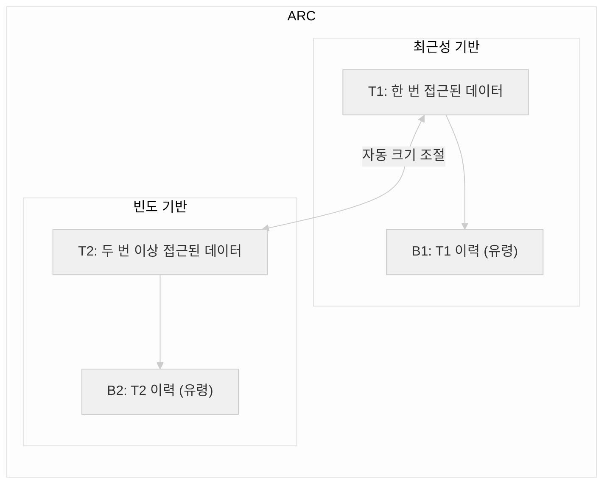
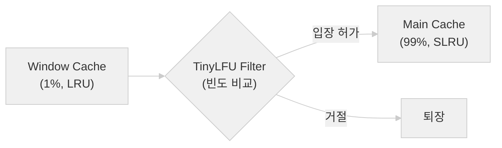

# 캐시의 모든 것 3편: 캐시 교체 정책 완벽 정리

> LRU부터 W-TinyLFU까지 — 캐시가 꽉 찼을 때 무엇을 버릴 것인가

---

## 들어가며

캐시는 용량이 한정되어 있다. 새 데이터를 넣으려면 기존 데이터를 내보내야 한다.

**어떤 데이터를 내보낼 것인가?**

이 질문에 대한 답이 **교체 정책**(Eviction Policy)이다. 교체 정책의 선택은 캐시 히트율에 직접적으로 영향을 미치고, 앞서 봤듯이 히트율 몇 %의 차이가 시스템 전체 성능을 좌우한다.

---

## 1. 기본 교체 정책

### 1-1. LRU (Least Recently Used)

> **가장 오래 전에 사용된** 데이터를 내보낸다

가장 널리 사용되는 교체 정책이다. 시간적 지역성을 직접적으로 활용한다.

```
접근 순서: A → B → C → D → A → E (4-way 캐시)

캐시 상태 변화:
A 접근: [A, -, -, -]
B 접근: [A, B, -, -]
C 접근: [A, B, C, -]
D 접근: [A, B, C, D]  ← 꽉 참
A 접근: [A, B, C, D]  ← A가 최근으로 갱신 (Hit!)
E 접근: [A, E, C, D]  ← B가 가장 오래됨 → B 교체
```

**구현**: 이중 연결 리스트 + 해시맵 → O(1) 접근/갱신

```python
# Python 내장 LRU 캐시
from functools import lru_cache

@lru_cache(maxsize=128)
def expensive_query(user_id):
    return database.query(user_id)
```

| 장점 | 단점 |
|------|------|
| 시간적 지역성 잘 활용 | 접근 순서 추적 오버헤드 |
| 일반적으로 높은 히트율 | 풀 스캔(전체 탐색) 시 캐시 오염 |
| 구현이 직관적 | way 수 많으면 하드웨어 비용 증가 |

**사용처**: Linux 페이지 캐시, Redis(`allkeys-lru`), 대부분의 CPU L1/L2

#### LRU의 약점: 캐시 오염

```python
# 큰 테이블 풀 스캔 — LRU를 망가뜨리는 전형적 패턴
for row in db.query("SELECT * FROM huge_table"):
    process(row)
# 한 번만 쓸 데이터가 캐시를 전부 차지!
# 자주 쓰던 인기 데이터가 모두 쫓겨남
```

이 문제를 해결하기 위해 다양한 변형이 탄생했다.

### 1-2. LFU (Least Frequently Used)

> **가장 적게 사용된** 데이터를 내보낸다

```
접근 횟수:
A: 100회  ← 인기 데이터
B: 50회
C: 3회
D: 1회   ← 가장 적게 사용 → 교체 대상
```

| 장점 | 단점 |
|------|------|
| 인기 데이터를 잘 보존 | 과거 인기 데이터가 잔류 (Stale 문제) |
| 풀 스캔에 강함 | 카운터 관리 오버헤드 |
| | 새 데이터가 정착하기 어려움 |

**Stale 문제 예시**: 어제 인기 있던 뉴스 기사(접근 10,000회)가 오늘 새로 뜬 기사(접근 5회)보다 우선순위가 높아 캐시를 계속 차지한다.

**사용처**: Redis(`allkeys-lfu`, `volatile-lfu`)

### 1-3. FIFO (First In, First Out)

> **가장 먼저 들어온** 데이터를 내보낸다

```
접근 순서: A → B → C → D → E (4-way)

A 접근: [A, -, -, -]
B 접근: [A, B, -, -]
C 접근: [A, B, C, -]
D 접근: [A, B, C, D]  ← 꽉 참
E 접근: [E, B, C, D]  ← A가 가장 먼저 → A 교체
```

- 구현이 **가장 단순** (큐 하나면 됨)
- 자주 쓰이는 데이터도 오래되면 쫓겨남
- **Belady의 이상 현상**: 캐시 크기를 늘렸는데 오히려 미스가 증가하는 경우 발생

**사용처**: 일부 임베디드 시스템, OS의 Clock 알고리즘 기반

### 1-4. Random (무작위)

> **아무거나** 내보낸다

의외로 나쁘지 않다.

- 구현 최단순 (난수 생성기만 있으면 됨)
- 하드웨어 오버헤드 최소
- **way 수가 많을수록 LRU와 성능 차이가 줄어듦**

| way 수 | LRU 히트율 | Random 히트율 | 차이 |
|--------|-----------|-------------|------|
| 2-way | 95.0% | 93.2% | 1.8% |
| 4-way | 96.5% | 95.8% | 0.7% |
| 8-way | 97.1% | 96.8% | 0.3% |

**사용처**: ARM Cortex 시리즈, 일부 GPU

---

## 2. 현대적 하이브리드 정책

기본 정책들의 약점을 보완하기 위해 탄생한 고급 알고리즘들이다.

### 2-1. ARC (Adaptive Replacement Cache)

> LRU와 LFU의 장점을 **자동으로 조합**하는 자가 적응형 알고리즘

IBM 연구소에서 2003년 발표. **두 개의 LRU 리스트**를 운영한다.



- **T1**: 한 번만 접근된 데이터 (최근성 중시)
- **T2**: 두 번 이상 접근된 데이터 (빈도 중시)
- **B1/B2**: 쫓겨난 데이터의 이력 (유령 캐시)
- B1에서 히트가 많으면 T1 확대, B2에서 히트가 많으면 T2 확대

**핵심**: 워크로드에 따라 최근성과 빈도 중 어디에 더 무게를 둘지 **자동으로 조절**한다.

| 장점 | 단점 |
|------|------|
| 워크로드 적응형 | 구현 복잡 |
| LRU, LFU 모두 능가 | IBM 특허 (2014년 만료) |
| 풀 스캔에 강함 | 메모리 사용량 약간 증가 |

**사용처**: ZFS 파일 시스템, PostgreSQL (shared_buffers)

### 2-2. W-TinyLFU (Window Tiny Least Frequently Used)

> 현대 캐시 라이브러리의 **최강자**

Google에서 영감을 받아 설계. **Caffeine** (Java 캐시 라이브러리)에서 사용한다.



동작 과정:
1. 새 데이터는 먼저 **Window Cache**(작은 LRU)에 들어감
2. Window에서 쫓겨날 때, **TinyLFU 필터**가 빈도를 비교
3. 새 데이터의 빈도 > Main Cache 교체 후보의 빈도 → 입장 허가
4. 아니면 → 바로 퇴장

**TinyLFU**는 Count-Min Sketch(확률적 자료구조)를 사용하여 **매우 적은 메모리**로 접근 빈도를 추정한다. 정확한 카운터 대신 확률적으로 추정하므로 오버헤드가 극히 낮다.

| 장점 | 단점 |
|------|------|
| 거의 최적의 히트율 | 구현 매우 복잡 |
| 풀 스캔에 강함 | |
| 메모리 효율적 | |
| 새 데이터도 빠르게 정착 | |

**사용처**: Caffeine (Java), Spring Cache 기본, Ristretto (Go)

### 정책 성능 비교 (벤치마크 경향)

| 정책 | 히트율 수준 |
|------|-----------|
| **W-TinyLFU** | 최고 |
| **ARC** | 매우 높음 |
| **LRU** | 높음 |
| **LFU** | 높음 (패턴에 따라 편차) |
| **FIFO** | 보통 |
| **Random** | 보통 |

---

## 3. 캐시 친화적 코드 작성법

교체 정책만큼 중요한 것이 **애초에 캐시를 잘 활용하는 코드**를 작성하는 것이다.

### 행 우선 vs 열 우선 접근

```python
# 1000 x 1000 2D 배열

# 행 우선 — 캐시 친화적 (연속 메모리 접근)
for i in range(1000):
    for j in range(1000):
        process(matrix[i][j])

# 열 우선 — 캐시 비친화적 (1000칸씩 점프)
for j in range(1000):
    for i in range(1000):
        process(matrix[i][j])
```

성능 차이: **수 배 ~ 수십 배**

### 구조체 배열(AoS) vs 배열 구조체(SoA)

```c
// AoS — 위치만 처리할 때 불필요한 데이터가 캐시 라인 차지
struct Entity { float x, y, z, vx, vy, vz; int hp, type; };
Entity entities[10000];

// SoA — 같은 필드끼리 연속, 캐시 라인 100% 활용
struct Entities {
    float x[10000], y[10000], z[10000];
    float vx[10000], vy[10000], vz[10000];
    int hp[10000], type[10000];
};
```

게임 개발에서 **ECS**(Entity Component System) 패턴이 인기 있는 이유 중 하나가 이 캐시 효율성이다.

### 핵심 원칙

1. **순차 접근**: 메모리를 순서대로 읽으면 캐시 라인을 최대한 활용
2. **데이터 밀집**: 함께 쓰는 데이터를 가까이 배치
3. **작은 작업 단위**: 캐시에 들어갈 만큼의 데이터를 한 번에 처리 (타일링)
4. **불필요한 데이터 회피**: 필요한 필드만 모아서 접근 (SoA 패턴)

---

## 정리

| 정책 | 기준 | 히트율 | 복잡도 | 대표 사용처 |
|------|------|--------|--------|-----------|
| **LRU** | 최근 미사용 | 높음 | 보통 | CPU, Redis, Linux |
| **LFU** | 사용 빈도 | 높음 | 보통 | Redis |
| **FIFO** | 먼저 온 순서 | 보통 | 낮음 | 임베디드 |
| **Random** | 무작위 | 보통 | 최저 | ARM, GPU |
| **ARC** | 자가 적응 | 최고 | 높음 | ZFS, PostgreSQL |
| **W-TinyLFU** | 빈도+최근성 | 최고 | 매우 높음 | Caffeine, Spring |

---

## 다음 편 예고

**4편: 캐시 스탬피드 — 상황과 해법**에서는 Cache Stampede, Penetration, Avalanche 문제와 뮤텍스 락, 확률적 조기 만료, Bloom Filter 등 실전 방어 패턴을 다룬다.

---

## 참고문헌

1. Megiddo, N. & Modha, D. S. (2003). "ARC: A Self-Tuning, Low Overhead Replacement Cache." *FAST '03*.
2. Einziger, G., Friedman, R. & Manes, B. (2017). "TinyLFU: A Highly Efficient Cache Admission Policy." *ACM Transactions on Storage*, 13(4).
3. Hennessy & Patterson. *Computer Architecture*, 6th Edition.
4. Al-Zoubi, H. et al. (2004). "Performance evaluation of cache replacement policies." *COMPSAC*.
5. Smith, A. J. (1982). "Cache Memories." *ACM Computing Surveys*, 14(3).

---


