# 1화. 첫 생성 — 프롬프트만 넣으면 되는 거 아니야?

*AI 이미지 생성 실전 가이드 | 사진 한 장을 완성하기까지*

<!-- more -->

---

## 들어가며

AI로 이미지를 만든다. 프롬프트 한 줄 쓰면 그럴듯한 사진이 나온다. 그렇게 들었다.

실제로 해보면 현실은 좀 다르다. "사진처럼 자연스러운 여성 인물"을 만들고 싶었을 뿐인데, 나오는 건 누구인지 모를 얼굴에 손가락이 6개고 옷은 녹아내리는 무언가다. 뭐가 잘못된 건지 감도 안 잡힌다.

이 시리즈는 그 삽질의 기록이다. 로컬 환경에서 SD 1.5 모델을 돌리며, 하나의 이미지를 완성하기까지 겪은 과정을 정리했다. 화려한 결과물 자랑이 아니라, **뭘 시도했고 뭐가 안 됐고 어떻게 고쳤는지**에 초점을 맞췄다.

최종 목표는 이것이다: **20대 여성 무투가가 태권도 금강 품새의 학다리 자세를 취하고 있는 실사 이미지**. 한 발로 서서 무릎을 올린 동적인 포즈, 태권도복, 사진처럼 자연스러운 인물. txt2img 한 방으로는 절대 나오지 않을 이미지다. 여기서부터 시작한다.


## 환경

- **모델**: Stable Diffusion 1.5 (Realistic Vision V5.1)
- **UI**: ComfyUI
- **GPU**: RTX 5060 Ti 16GB
- **OS**: Pop!_OS 24.04 LTS

SD 1.5를 선택한 이유는 단순하다. VRAM 부담이 적고, 생태계가 가장 넓다. ControlNet, LoRA, 인페인팅 등 후처리에 필요한 도구가 전부 SD 1.5 기반으로 가장 많이 만들어져 있다. SDXL이나 Flux가 품질은 더 좋지만, 16GB에서 복잡한 파이프라인을 돌리려면 SD 1.5가 현실적이다.


## 모델 선택이 반이다

Stable Diffusion은 "모델"을 바꾸면 완전히 다른 그림이 나온다. 같은 프롬프트를 넣어도 모델에 따라 화풍, 품질, 분위기가 천차만별이다.

SD 1.5 기반 체크포인트는 수천 개가 있다. 대표적인 것만 꼽으면:

- **Realistic Vision**: 실사 특화. 사진 같은 결과물을 원할 때.
- **DreamShaper**: 범용. 일러스트와 실사 중간 느낌. 처음 시작하기 좋다.
- **Anything v5**: 애니메이션/일러스트 특화. 깔끔한 선화.
- **RevAnimated**: 판타지/게임 느낌. 디테일이 화려하다.

이 시리즈에서는 **Realistic Vision V5.1**을 메인으로 사용한다. 목표가 실사 이미지이므로, 실사에 특화된 모델을 쓰는 게 맞다.

### 삽질 1: 모델을 아무거나 골랐다

처음에는 "SD 1.5면 다 비슷하겠지"라고 생각했다. 아니었다. 어떤 모델은 얼굴이 뭉개지고, 어떤 모델은 색감이 탁하고, 어떤 모델은 특정 스타일에서만 결과가 좋았다.

**교훈**: 모델은 화구다. 수채화 물감으로 유화를 그릴 수 없듯이, 애니메이션 모델로 실사 스타일을 뽑으면 어정쩡한 결과가 나온다. 원하는 스타일에 맞는 모델을 먼저 골라야 한다.


## 첫 번째 생성

ComfyUI에서 가장 기본적인 워크플로를 구성한다.

```
[체크포인트 로드] -> [프롬프트 입력] -> [빈 이미지(512x768)] -> [KSampler] -> [VAE 디코드] -> [저장]
```

프롬프트를 넣어본다.


## 프롬프트의 함정

### 삽질 2: 프롬프트를 길게 쓰면 좋아질 거라고 생각했다

SD 1.5는 CLIP 토큰 제한이 77개다. 그 이상 쓰면 뒤쪽 단어는 영향력이 급격히 떨어진다. 프롬프트를 장문으로 쓰면 모델이 어디에 집중해야 할지 혼란스러워하고, 결과가 뒤섞인다.

**나쁜 예 — 장문 프롬프트:**

> **Positive**: a beautiful gorgeous stunning young woman with long flowing silky black hair wearing an elegant luxurious red silk dress with intricate gold embroidery standing in a beautiful garden with roses and cherry blossoms under soft golden sunset lighting with bokeh background, masterpiece, best quality, ultra detailed, 8k uhd, sharp focus, professional photography, highly detailed face, perfect skin, glowing eyes, dramatic composition
>
> **Negative**: ugly, deformed, bad anatomy, bad hands, missing fingers, extra fingers, blurry, low quality, worst quality, watermark, text, signature
>
> **설정**: Realistic Vision V5.1 | 512x768 | DPM++ SDE Karras | Steps 20 | CFG 7.0 | Seed 42

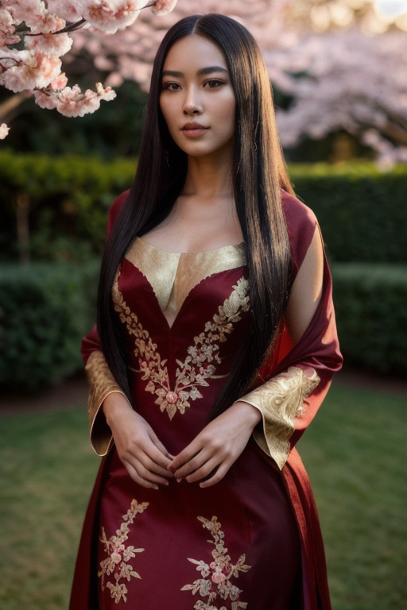

원하는 건 "정원에서 빨간 드레스를 입은 여성"이었다. 결과물을 보면 대충 그런 느낌은 나지만, 손가락이 뭉개지고 의상 디테일이 녹아내린다. 프롬프트에 너무 많은 걸 욱여넣은 탓이다.

**개선 — 핵심만 남긴 프롬프트:**

> **Positive**: young woman, black hair, red dress, garden, sunset lighting, photo, realistic
>
> **Negative**: ugly, deformed, bad anatomy, bad hands, missing fingers, extra fingers, blurry, low quality, worst quality, watermark, text, signature
>
> **설정**: Realistic Vision V5.1 | 512x768 | DPM++ SDE Karras | Steps 20 | CFG 7.0 | Seed 42

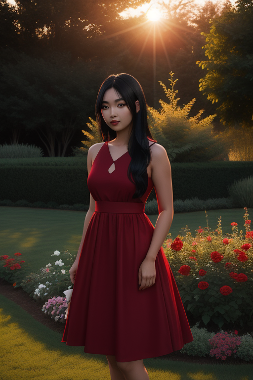

같은 시드, 같은 설정인데 프롬프트만 줄였다. 모델이 집중할 수 있는 키워드가 적어지니 오히려 구도와 인물 표현이 안정된다. 완벽하진 않지만, 장문보다 낫다.


### 프롬프트 가중치

특정 요소를 강조하고 싶으면 괄호와 숫자를 쓴다.

```
(red dress:1.3), (black hair:1.1), young woman
```

- `1.0`이 기본값
- `1.1~1.3`이면 적당한 강조
- `1.5` 이상은 과하다. 이미지가 깨지기 시작한다.

### 삽질 3: 가중치를 너무 높게 줬다

> **Positive**: (beautiful face:1.8), (perfect eyes:1.8), young woman, black hair, red dress
>
> **Negative**: ugly, deformed, bad anatomy, bad hands, missing fingers, extra fingers, blurry, low quality, worst quality, watermark, text, signature
>
> **설정**: Realistic Vision V5.1 | 512x768 | DPM++ SDE Karras | Steps 20 | CFG 7.0 | Seed 42

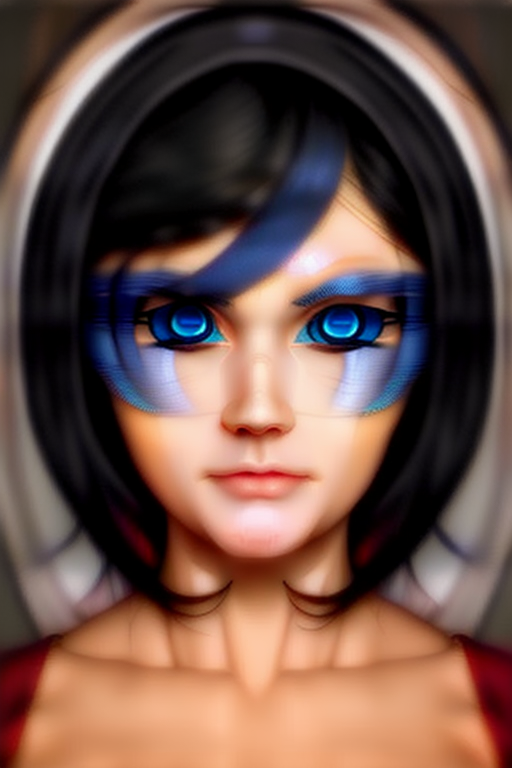

`(beautiful face:1.8)`을 넣었더니 얼굴이 예뻐지는 게 아니라 완전히 붕괴됐다. 눈 주변에 글리치 패턴이 생기고, 피부가 왁스처럼 녹아내린다. 가중치는 "더 예쁘게"가 아니라 "이 개념에 더 집중해"라는 의미다. 과하면 독이 된다.

**적절한 가중치로 수정:**

> **Positive**: (red dress:1.2), young woman, black hair, garden, photo, realistic
>
> **Negative**: ugly, deformed, bad anatomy, bad hands, missing fingers, extra fingers, blurry, low quality, worst quality, watermark, text, signature
>
> **설정**: Realistic Vision V5.1 | 512x768 | DPM++ SDE Karras | Steps 20 | CFG 7.0 | Seed 42

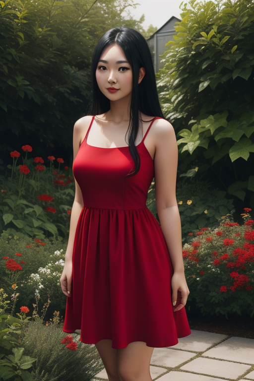

1.2 정도면 드레스가 좀 더 강조되면서도 이미지가 깨지지 않는다.


## 해상도의 함정

### 삽질 4: 고해상도로 생성하면 더 좋을 줄 알았다

SD 1.5는 **512x512** 또는 **512x768**로 학습됐다. 이 해상도에서 가장 안정적인 결과가 나온다.

> **Positive**: young woman, black hair, red dress, portrait, photo, realistic
>
> **Negative**: ugly, deformed, bad anatomy, bad hands, missing fingers, extra fingers, blurry, low quality, worst quality, watermark, text, signature
>
> **설정**: Realistic Vision V5.1 | **1024x1024** | DPM++ SDE Karras | Steps 20 | CFG 7.0 | Seed 42

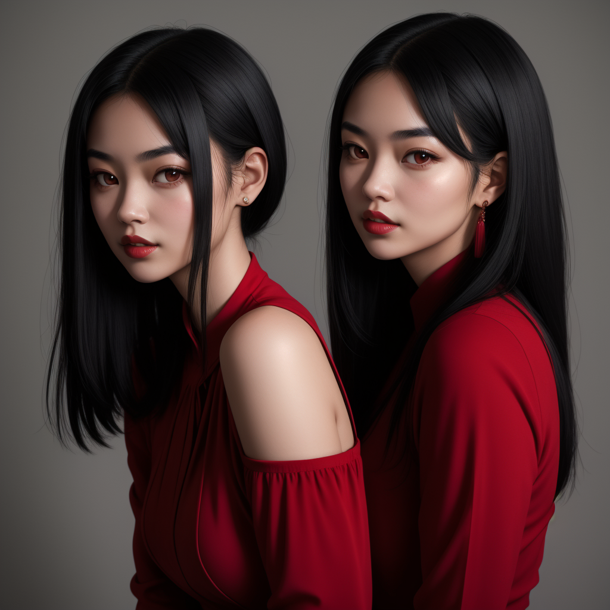

1024x1024로 바로 생성했더니 인물이 두 명 나왔다. 모델이 학습한 해상도를 벗어나면 구조를 잡지 못하고, 같은 패턴을 반복하거나 여러 인물을 합성하는 현상이 나타난다.

**해결**: 512x768로 생성한 다음, 나중에 업스케일한다.


## 샘플러와 스텝

KSampler의 설정도 결과에 영향을 준다.

- **샘플러**: Realistic Vision은 `DPM++ SDE Karras`가 권장된다. `euler_ancestral`도 쓸 수 있지만 실사 모델에서는 SDE 계열이 더 안정적인 결과를 준다.
- **스텝**: 20~30이 적당하다. 10 이하면 흐릿하고, 50 이상이면 과하게 수렴해서 딱딱해진다.
- **CFG Scale**: 7~8이 기본. 높으면 프롬프트에 과도하게 충실해지면서 부자연스러워지고, 낮으면 프롬프트를 무시한다.

### 삽질 5: CFG를 높이면 프롬프트대로 나올 줄 알았다

> **Positive**: young woman, black hair, red dress, garden, sunset lighting, photo, realistic
>
> **Negative**: ugly, deformed, bad anatomy, bad hands, missing fingers, extra fingers, blurry, low quality, worst quality, watermark, text, signature
>
> **설정**: Realistic Vision V5.1 | 512x768 | DPM++ SDE Karras | Steps 20 | **CFG 15.0** | Seed 42

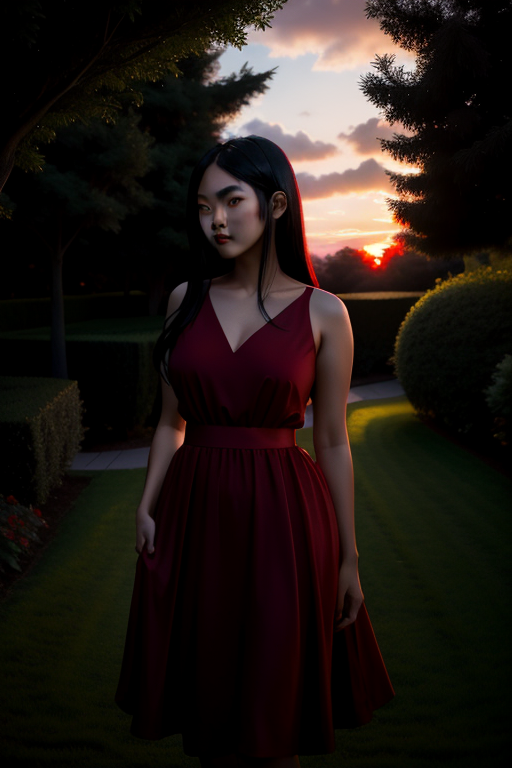

CFG 15로 올렸더니 색이 과포화되고 콘트라스트가 극단적으로 높아졌다. 얼굴에 기묘한 그림자가 생기면서 공포물 분위기가 됐다. 프롬프트에 "충실"하긴 한데, 자연스러움은 사라진다.

**비교 — CFG 3:**

> **설정**: 위와 동일, **CFG 3.0** | Seed 42

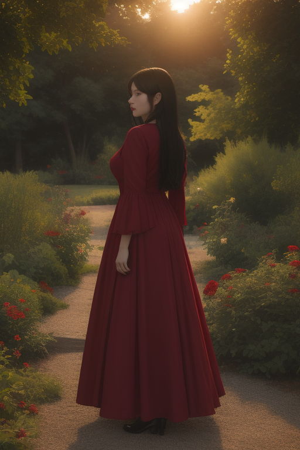

CFG를 3으로 낮추면 프롬프트 영향이 약해진다. 모델이 자유롭게 생성하기 때문에 오히려 자연스러운 구도가 나올 수 있지만, 원하는 요소가 빠질 수 있다. 7~8에서 시작하고, 필요하면 0.5 단위로 조절하는 게 안전하다.


## 네거티브 프롬프트

원하지 않는 요소를 지정하는 프롬프트다. 없어도 이미지는 생성되지만, 있으면 품질이 확실히 올라간다.

**네거티브 프롬프트 없이 생성:**

> **Positive**: young woman, black hair, red dress, garden, photo, realistic
>
> **Negative**: *(없음)*
>
> **설정**: Realistic Vision V5.1 | 512x768 | DPM++ SDE Karras | Steps 20 | CFG 7.0 | Seed 42

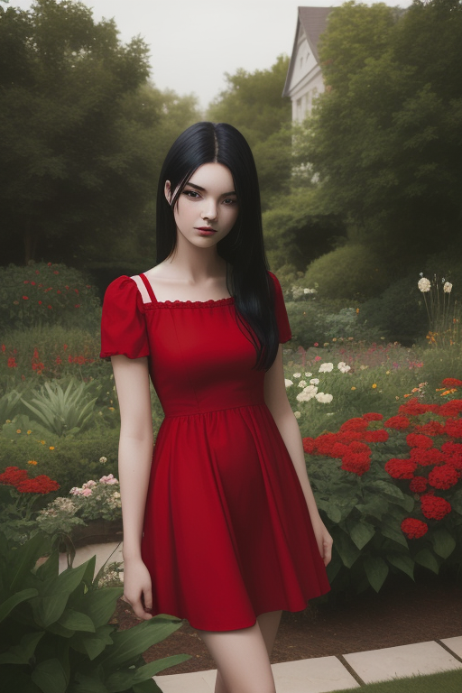

**기본 네거티브 세트:**
```
ugly, deformed, bad anatomy, bad hands, missing fingers,
extra fingers, blurry, low quality, worst quality,
watermark, text, signature
```

**인물 특화 추가:**
```
bad face, asymmetric eyes, deformed iris, cross-eyed,
mutated hands, extra limbs, cloned face
```

네거티브 프롬프트는 "이것만 넣으면 만사 해결"이 아니다. 안 넣으면 확률적으로 더 자주 나오는 문제를 줄여줄 뿐이다. 손가락 6개가 나오는 문제는 네거티브로 완전히 해결되지 않는다. 그건 별도의 후처리가 필요하다.


## 시드와 재현성

같은 프롬프트를 넣어도 매번 다른 이미지가 나온다. 이건 **시드**(seed) 값이 매번 랜덤으로 바뀌기 때문이다.

마음에 드는 결과가 나왔으면 시드를 기록해둬야 한다. 시드를 고정하면 같은 프롬프트로 같은 이미지를 재현할 수 있다.

다만, 시드를 고정해도 다른 설정(모델, 샘플러, CFG 등)을 바꾸면 결과가 달라진다. 시드는 "완전히 같은 조건"에서만 재현성을 보장한다.


## 첫 결과 평가

기본 설정으로 몇 장을 뽑아보면 패턴이 보인다.

**비교적 괜찮은 결과:**

> **Positive**: young woman, black hair, red dress, soft lighting, detailed face, photo, realistic
>
> **Negative**: ugly, deformed, bad anatomy, bad hands, missing fingers, extra fingers, blurry, low quality, worst quality, watermark, text, signature, bad face, asymmetric eyes, deformed iris, cross-eyed, mutated hands, extra limbs
>
> **설정**: Realistic Vision V5.1 | 512x768 | DPM++ SDE Karras | Steps 20 | CFG 7.5 | Seed 777

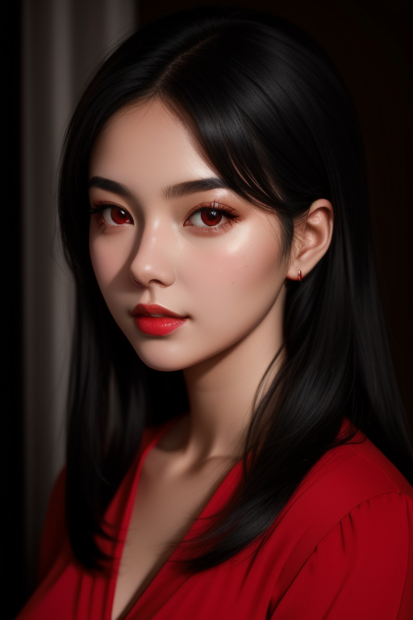

실사 모델답게 피부 질감과 조명이 사진에 가깝다. 하지만 자세히 보면 아직 AI 특유의 어색함이 남아 있다.

**손가락이 이상한 결과:**

> **Positive**: young woman, counting fingers, holding up both hands, spread fingers, ten fingers visible, photo, realistic
>
> **Negative**: ugly, deformed, blurry, low quality, worst quality, watermark, text, signature
>
> **설정**: Realistic Vision V5.1 | 512x768 | DPM++ SDE Karras | Steps 20 | CFG 7.0 | Seed 88

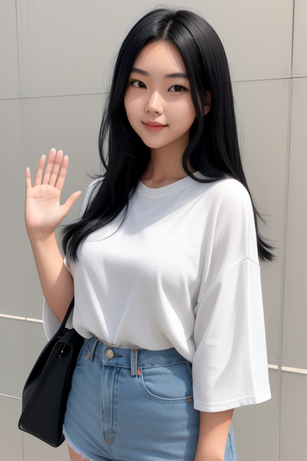

"열 손가락을 보여달라"고 했더니 손이 4개가 나왔다. 손가락 개수도 맞지 않고, 있을 수 없는 위치에서 손가락이 자라난다. 복잡한 손 포즈를 요구할수록 문제가 극적으로 드러난다. SD 1.5의 고질적 문제다.

**잘 되는 것:**
- 전체적인 분위기와 구도
- 의상의 대략적인 형태
- 조명과 색감의 방향

**안 되는 것:**
- 손가락 (거의 항상 이상함)
- 얼굴 디테일 (좌우 비대칭, 눈 크기 불일치)
- 구도 제어 (포즈를 프롬프트로 잡기 어려움)
- 일관성 (같은 캐릭터를 여러 장 뽑을 수 없음)


## 시리즈 작업물: 첫 시도

지금까지 배운 내용을 시리즈 목표 이미지에 적용해본다. "20대 여성 무투가, 태권도복, 학다리 자세"를 txt2img로 뽑아보자.

> **Positive**: young woman, 20 years old, taekwondo uniform, dobok, crane stance, one leg standing, martial arts, full body, photo, realistic
>
> **Negative**: ugly, deformed, bad anatomy, bad hands, missing fingers, extra fingers, blurry, low quality, worst quality, watermark, text, signature, bad face, asymmetric eyes, mutated hands, extra limbs
>
> **설정**: Realistic Vision V5.1 | 512x768 | DPM++ SDE Karras | Steps 20 | CFG 7.0 | Seed 100

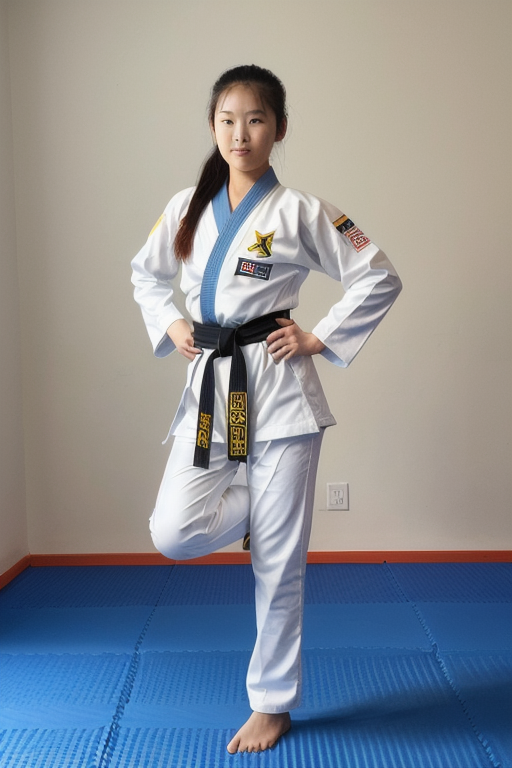

예상대로 한 방에 되지 않는다. 태권도복 비슷한 옷은 입고 있지만, 학다리 자세는 나오지 않는다. 프롬프트만으로 복잡한 포즈를 제어하는 건 불가능에 가깝다. 손과 발의 위치도 엉망이다.

이것이 이 시리즈의 출발점이다. 여기서부터 하나씩 고쳐나간다.


## 정리

1화에서 배운 것:

- **모델 선택**이 결과의 절반을 결정한다
- **프롬프트는 짧고 핵심적으로**. 길면 오히려 방해된다
- **해상도는 512x768**로. 고해상도 직접 생성은 금물
- **가중치는 1.3 이하**로 절제
- **CFG는 7~8**, 샘플러는 DPM++ SDE Karras
- **시드를 기록**해두면 나중에 재현할 수 있다
- txt2img만으로는 한계가 명확하다. 여기서부터 시작이다.

다음에는 "원하는 포즈가 안 나온다"는 문제를 ControlNet으로 풀어볼 생각이다.

---

*다음: [2화. 구도와 포즈 — ControlNet 입문](ai-image-guide-02-controlnet.md)*
