# 2화. 구도와 포즈 — ControlNet 입문

*AI 이미지 생성 실전 가이드 | 사진 한 장을 완성하기까지*

<!-- more -->

---

## 들어가며

1화에서 txt2img의 한계를 확인했다. 프롬프트만으로는 원하는 포즈를 잡을 수 없다. "팔을 들어올린 여성"이라고 써도, 모델이 해석하는 방법은 수십 가지다. 팔이 어디에 있는지, 몸이 어느 방향을 향하는지, 카메라 앵글은 어떤지 — 전부 운에 맡기게 된다.

왼쪽은 원하는 포즈가 담긴 참조 사진이다. 가운데는 같은 프롬프트로 ControlNet 없이 생성한 결과 — 포즈를 제어할 수 없다. 오른쪽은 참조 사진의 포즈를 OpenPose ControlNet으로 지정한 결과다.

| 참조 사진 (원하는 포즈) | txt2img (포즈 제어 불가) | OpenPose ControlNet (포즈 제어) |
|:---:|:---:|:---:|
| 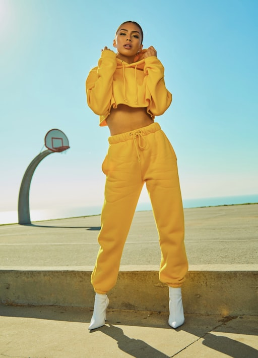 | 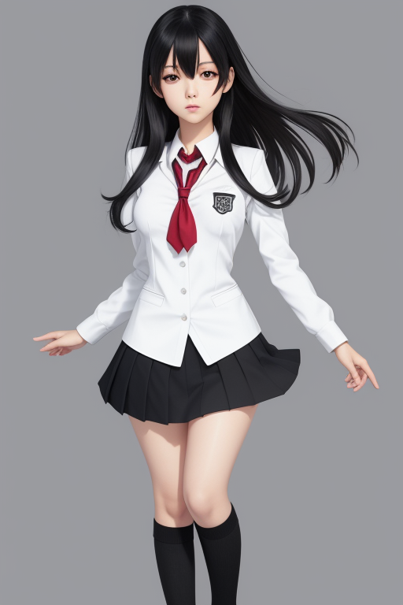 | 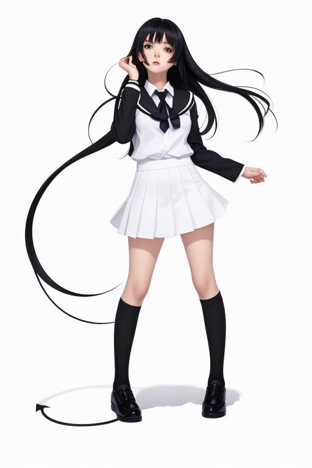 |

ControlNet은 이 문제를 해결한다. 참조 이미지에서 포즈, 윤곽선, 깊이 정보를 추출하고, 그 구조를 유지한 채 새로운 이미지를 생성한다. 프롬프트가 "무엇을"이라면, ControlNet은 "어떻게"를 지정하는 도구다.


## ControlNet이란

ControlNet은 Stable Diffusion에 **조건부 제어**를 추가하는 확장 모델이다. 기본 원리는 단순하다.

1. 참조 이미지를 전처리기(preprocessor)로 변환한다 (포즈, 엣지, 깊이맵 등)
2. 변환된 조건 이미지를 ControlNet 모델에 넣는다
3. ControlNet이 Stable Diffusion의 생성 과정에 개입해서 구조를 유지시킨다

"이 뼈대를 유지하면서 그림을 그려라"는 지시를 추가하는 것이다.


## 환경 준비

### 필요한 파일

ControlNet을 사용하려면 두 가지가 필요하다.

1. **ControlNet 모델 파일** (.pth 또는 .safetensors)
2. **전처리기 노드** (ComfyUI 확장)

ComfyUI는 ControlNet을 기본 지원한다. 모델 파일만 올바른 위치에 넣으면 노드가 자동으로 인식한다.

### 모델 다운로드

이 글에서 다루는 ControlNet 모델은 세 가지다.

| 모델 | 용도 | 파일명 |
|------|------|--------|
| OpenPose | 인체 포즈 제어 | `control_v11p_sd15_openpose.pth` |
| Canny | 윤곽선 유지 | `control_v11p_sd15_canny.pth` |
| Depth | 깊이/원근 제어 | `control_v11f1p_sd15_depth.pth` |

[lllyasviel/ControlNet-v1-1](https://huggingface.co/lllyasviel/ControlNet-v1-1/tree/main) 저장소에서 다운로드한다. 각 파일은 약 1.4GB다.

모델 파일은 ComfyUI의 `models/controlnet/` 디렉토리에 넣는다.

```
ComfyUI/
  models/
    controlnet/
      control_v11p_sd15_openpose.pth
      control_v11p_sd15_canny.pth
      control_v11f1p_sd15_depth.pth
```

!!! warning "모델 버전 일치"
    위 파일들은 전부 SD 1.5용이다. SDXL 체크포인트와 함께 사용하면 결과가 완전히 깨진다. 에러 메시지 없이 생성이 완료되기 때문에, 다른 설정 문제로 착각하기 쉽다. 체크포인트와 ControlNet 모델의 버전이 반드시 일치해야 한다.

### 전처리기 노드 설치

참조 이미지를 포즈맵이나 엣지맵으로 변환하려면 전처리기 노드가 필요하다. **ComfyUI ControlNet Auxiliary Preprocessors**를 설치한다.

```bash
cd ComfyUI/custom_nodes/
git clone https://github.com/Fannovel16/comfyui_controlnet_aux
cd comfyui_controlnet_aux
pip install -r requirements.txt
```

ComfyUI를 재시작하면 OpenPose, Canny, Depth 등의 전처리 노드가 추가된다.


## OpenPose: 포즈 제어

가장 많이 쓰는 ControlNet이다. 참조 이미지에서 인체 관절 위치를 추출하고, 그 포즈를 유지한 채 새로운 이미지를 생성한다.

### 워크플로 구성

기본 txt2img 워크플로에 ControlNet 노드를 추가한다.

```
[이미지 로드] → [OpenPose 전처리기] → [ControlNet Apply]
                                             ↓
[체크포인트 로드] → [프롬프트] → [KSampler] → [VAE 디코드] → [저장]
```

핵심 노드 네 개:

1. **Load Image** — 참조할 포즈 이미지를 불러온다
2. **OpenPose Preprocessor** — 이미지에서 관절 위치를 추출한다
3. **Load ControlNet Model** — ControlNet 모델을 로드한다
4. **Apply ControlNet** — 조건을 positive 프롬프트에 연결한다

### 참조 이미지 선택

아무 이미지나 넣으면 되는 건 아니다.

**좋은 참조 이미지:**

- 배경이 단순하다 (단색이 이상적)
- 인물이 한 명이다
- 몸 전체가 보인다
- 관절이 가려지지 않았다

**나쁜 참조 이미지:**

- 배경이 복잡하다 (다른 사람, 사물이 많다)
- 인물이 여러 명이다 (관절이 뒤섞인다)
- 몸이 잘려 있다 (포즈 추출이 불완전하다)
- 두꺼운 옷이나 소품이 관절을 가린다

복잡한 배경의 이미지를 넣으면, 배경의 사물까지 포즈맵에 잡혀서 결과에 의도하지 않은 요소가 섞여 들어올 수 있다.

### 포즈맵 확인

OpenPose 전처리기를 거치면 참조 이미지가 검은 배경 위의 스틱피겨(관절 연결선)로 변환된다. 이 포즈맵이 생성의 뼈대가 된다.

| 참조 사진 | 추출된 포즈맵 |
|:---:|:---:|
|  | 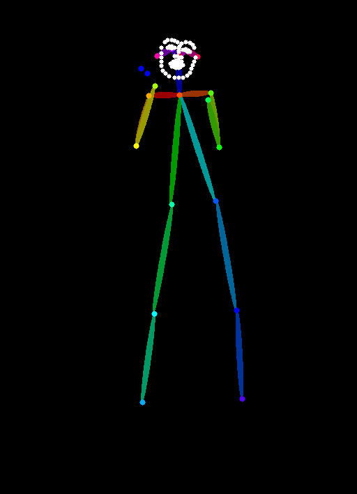 |

포즈맵을 **반드시 먼저 확인**해야 한다. 관절이 잘못 잡히면 결과도 이상해진다. 팔꿈치가 반대로 꺾이거나, 목이 비현실적으로 긴 포즈맵이 나오면 참조 이미지를 바꿔야 한다.

ComfyUI에서는 OpenPose 전처리기 노드의 출력을 Preview Image 노드에 연결하면 포즈맵을 바로 볼 수 있다.

### ControlNet Strength

ControlNet의 영향력을 조절하는 값이다. Apply ControlNet 노드의 `strength` 파라미터로 설정한다.

| Strength | 결과 |
|----------|------|
| 0.0 | ControlNet 무시. txt2img와 동일 |
| 0.5~0.7 | 대략적인 포즈만 참조. 느슨하지만 자연스럽다 |
| **1.0** | **포즈를 충실하게 따른다. 대부분 이 값이 적당하다** |
| 1.5 이상 | 과도하게 종속된다. 관절 부위에 아티팩트가 생기기 시작한다 |

1.0에서 시작하고, 포즈가 너무 딱딱하면 0.8로 내리고, 느슨하면 1.2까지 올려본다. 1.5를 넘기면 포즈맵의 선이 결과물에 그대로 묻어나오는 현상이 나타날 수 있다.

| Strength 0.3 | Strength 1.0 | Strength 1.5 | Strength 1.8 |
|:---:|:---:|:---:|:---:|
| 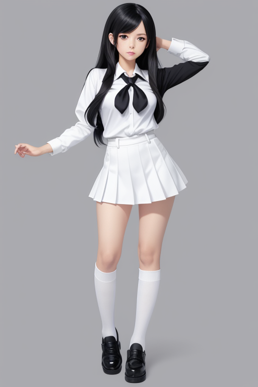 | 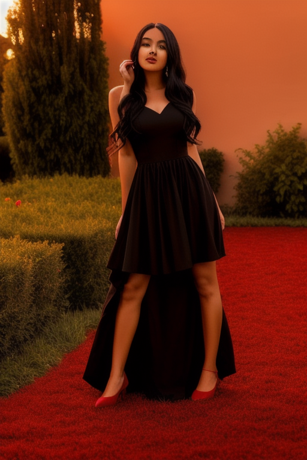 | 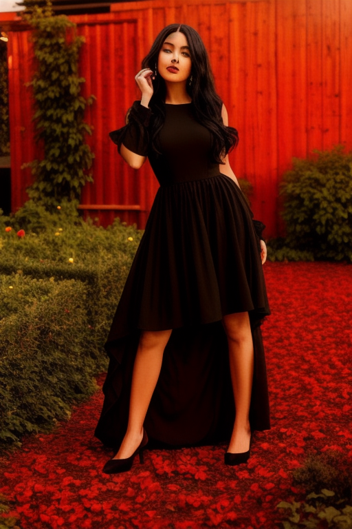 | 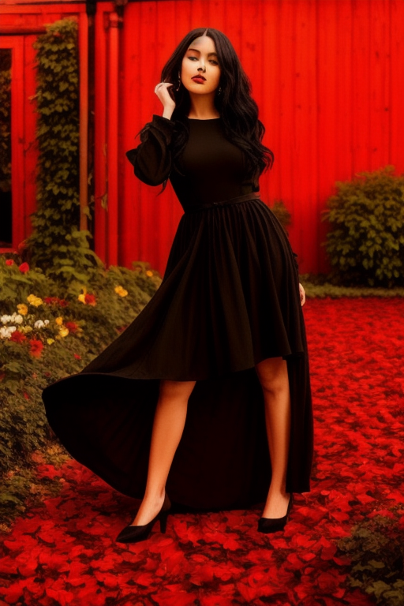 |

같은 포즈맵, 같은 시드, 같은 프롬프트에서 strength만 변경한 결과다. 0.3에서는 포즈의 영향이 느슨하고, 1.0에서는 참조 포즈를 충실하게 따른다. 1.5부터 아티팩트가 나타나기 시작하고, 1.8에서는 바닥에 부자연스러운 패턴이 생기거나 눈 주변에 얼룩이 나타나는 등 과도한 종속의 흔적이 보인다.

비교 이미지를 만들 때 주의할 점이 있다. `euler_ancestral` 같은 확률적 샘플러를 쓰면, strength가 달라질 때 생성 과정 전체가 바뀌어서 캐릭터 외형까지 달라진다. 파라미터 비교 실험에는 `euler` 같은 결정론적 샘플러를 쓰는 것이 낫다.

### Start/End Percent

ControlNet이 디노이징 과정에서 개입하는 구간을 지정한다.

- **start_percent** — ControlNet이 시작하는 시점 (0.0 = 처음부터)
- **end_percent** — ControlNet이 끝나는 시점 (1.0 = 마지막까지)

| start | end | 효과 |
|-------|-----|------|
| 0.0 | 1.0 | 전 구간 적용. 포즈를 가장 정확하게 따른다. |
| 0.0 | 0.8 | 후반 20%에서 ControlNet을 푼다. 디테일이 자연스러워진다. |
| 0.0 | 0.5 | 대략적인 구조만 잡고, 나머지는 모델이 자유롭게 생성한다. |

문서에서는 0.0~0.8을 권장하는 경우가 많다. 마지막 구간에서 ControlNet을 풀어주면 디테일이 자연스러워진다는 논리다.

실제로 해보면 차이는 거의 없다. 0.3, 0.8, 1.0을 나란히 놓고 비교해도 얼굴이 아주 미묘하게 다른 정도다.

| End 0.3 | End 0.8 | End 1.0 |
|:---:|:---:|:---:|
| 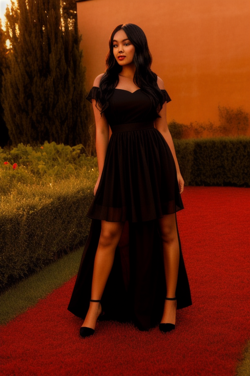 | 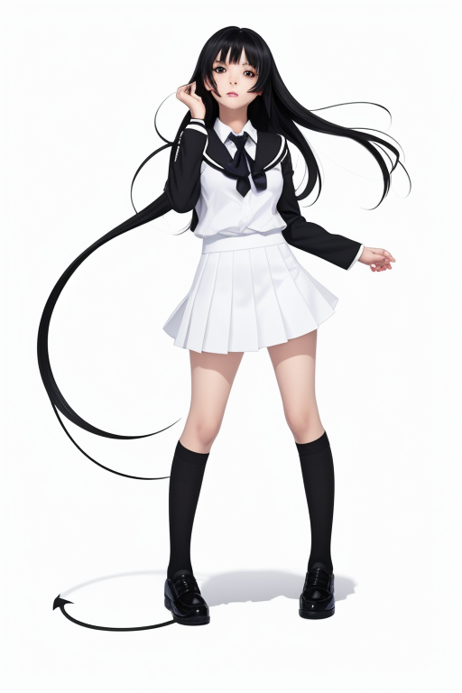 |  |

포즈는 디노이징 초반 스텝에서 이미 결정되기 때문에, 후반부를 풀어줘도 포즈에는 영향이 없고, 세부 디테일 차이도 눈에 띄지 않는다.

처음에는 기본값 1.0으로 두고 신경 쓰지 않아도 된다. 나중에 결과물을 비교하면서 미세하게 다른 부분이 보이면 그때 조정해도 늦지 않다.


## Canny: 윤곽선 제어

Canny는 참조 이미지의 **윤곽선(edge)**을 추출한다. OpenPose가 관절 위치만 잡는다면, Canny는 이미지의 형태 전체를 윤곽으로 잡아낸다.

### 언제 쓰나

- 특정 구도를 정확하게 재현하고 싶을 때
- 윤곽선 형태를 유지하면서 스타일만 바꾸고 싶을 때
- 인물이 아닌 사물의 형태를 제어할 때 (의자, 건물, 소품 등)

### 워크플로

OpenPose와 동일한 구조다. 전처리기를 **Canny Edge**로 바꾸고, ControlNet 모델도 Canny용으로 교체한다.

### 특성

Canny는 OpenPose보다 제약이 강하다. 윤곽선 전체를 따르기 때문에, 참조 이미지와 거의 같은 형태의 결과물이 나온다.

포즈 제어에 Canny를 쓰면 참조 이미지의 옷 주름, 머리카락 형태까지 그대로 따라가서, 새로운 캐릭터를 만드는 게 아니라 원본을 "따라 그리는" 결과가 된다. **포즈 제어에는 OpenPose, 형태 유지에는 Canny** — 목적에 맞는 ControlNet을 써야 한다.


## Depth: 깊이 제어

Depth는 참조 이미지의 **깊이 정보**를 추출한다. 가까운 부분은 밝게, 먼 부분은 어둡게 표현하는 깊이맵(depth map)을 만든다.

### 언제 쓰나

- 원근감을 유지하고 싶을 때
- 인물과 배경의 거리감을 제어할 때
- Canny보다 느슨하게, OpenPose보다 넓은 범위를 제어하고 싶을 때

### 특성

Depth는 OpenPose와 Canny의 중간 지점이다. 전체적인 공간 배치를 유지하면서도, 세부 형태는 모델이 자유롭게 생성한다.

인물 사진에 적용하면 "비슷한 구도에 비슷한 크기의 인물"이 나오지만, 윤곽선까지 따라가지는 않는다. 의상이나 표정은 프롬프트에 따라 달라진다.


## 비교: 세 ControlNet의 차이

같은 참조 이미지에 세 ControlNet을 각각 적용했을 때의 차이를 정리한다.

| ControlNet | 추출하는 것 | 제약 강도 | 적합한 용도 |
|-----------|-----------|----------|-----------|
| OpenPose | 관절 위치 (스틱피겨) | 낮음 | 인물 포즈 제어 |
| Canny | 윤곽선 전체 | 높음 | 형태 유지, 스타일 변환 |
| Depth | 깊이/원근 정보 | 중간 | 구도와 공간감 제어 |

같은 참조 이미지에 세 ControlNet을 각각 적용한 결과:

| 참조 사진 | OpenPose | Canny | Depth |
|:---:|:---:|:---:|:---:|
|  |  | 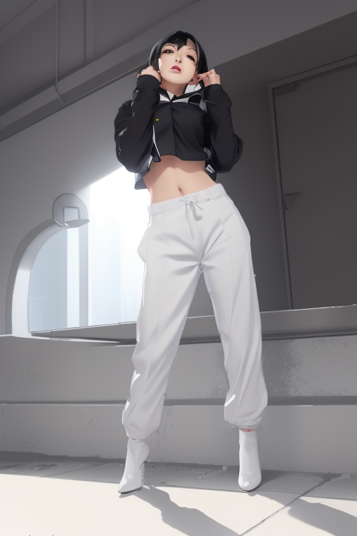 | 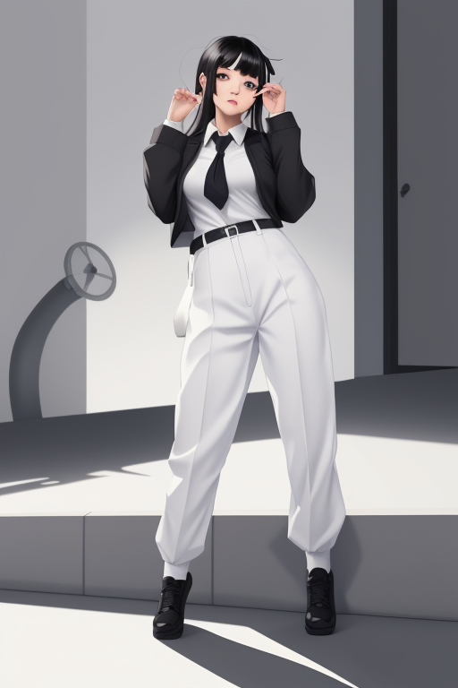 |

| | OpenPose 맵 | Canny 맵 | Depth 맵 |
|:---:|:---:|:---:|:---:|
| 전처리 결과 |  | 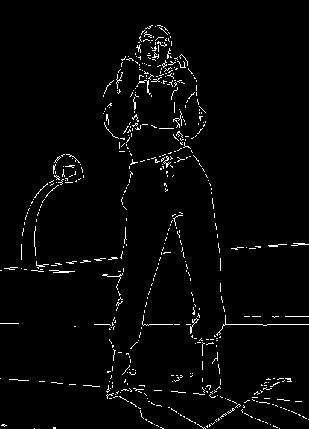 | 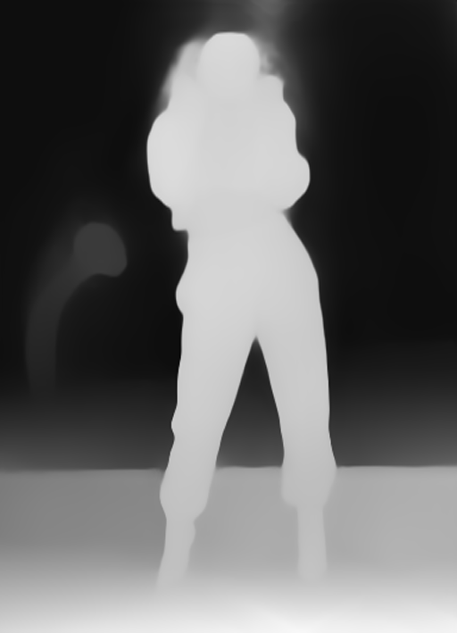 |

실제 작업에서는 하나만 쓰기보다 **조합**하는 경우가 많다. OpenPose로 포즈를 잡고, Depth로 공간감을 보정하는 식이다. ComfyUI에서는 Apply ControlNet 노드를 직렬로 연결해서 여러 ControlNet을 동시에 적용할 수 있다.


## 원하는 포즈 만들기

### 방법 1: 기존 사진 활용

인터넷에서 원하는 포즈의 사진을 찾아서 참조로 쓴다. 가장 간단하지만, 딱 원하는 포즈를 찾기 어려울 수 있다.

[Unsplash](https://unsplash.com), [Pexels](https://www.pexels.com) 같은 무료 사진 사이트에서 "pose", "portrait", "standing" 등으로 검색하면 다양한 포즈를 찾을 수 있다. 어차피 포즈맵만 추출하므로, 사진의 품질이나 인물의 외모는 상관없다.

### 방법 2: 포즈 에디터

원하는 포즈를 직접 만들 수 있는 도구다.

- [OpenPose Editor](https://github.com/huchenlei/sd-webui-openpose-editor) — 웹 기반. 관절을 드래그해서 포즈를 만든다.
- [PoseMyArt](https://posemy.art/) — 무료 3D 포즈 레퍼런스.
- [Magic Poser](https://magicposer.com/) — 3D 모델 기반 포즈 도구.

직접 만든 포즈맵을 ControlNet에 넣으면, 참조 사진 없이도 정확한 포즈 제어가 가능하다. OpenPose Editor의 경우, 출력이 이미 포즈맵 형태이므로 전처리기 없이 바로 Apply ControlNet에 연결할 수 있다.

### 방법 3: 직접 촬영

스마트폰으로 원하는 포즈를 직접 찍는다. 가장 정확하다. 배경은 단순하게, 관절이 가려지지 않게 주의한다.


## 삽질 기록

### 참조 이미지 선택의 중요성

처음에 초상화(얼굴 클로즈업) 사진을 참조 이미지로 썼다. OpenPose가 전신 스켈레톤을 추출했는데, 생성 결과는 얼굴만 나왔다. 참조 이미지의 프레임과 생성 이미지의 프레임이 일치하지 않으면, 포즈맵이 정확해도 결과가 어긋난다.

전신 포즈를 제어하려면 전신 사진을, 얼굴 각도를 제어하려면 얼굴 사진을 참조로 써야 한다.

### Strength/End Percent 비교 시 포즈맵 재사용

처음에 각 생성마다 전처리기를 다시 실행하는 워크플로를 구성했다. 같은 이미지를 넣었는데 결과가 달랐다. 원인은 전처리기의 비결정론적 동작이었다 — OpenPose 전처리기가 실행할 때마다 관절 위치를 미세하게 다르게 추출한다.

해결 방법: 포즈맵을 한 번 추출해서 이미지로 저장한 뒤, 이후 생성에서는 저장된 포즈맵을 직접 로드해서 사용한다. 전처리기를 건너뛰고 포즈맵 이미지를 ControlNet에 바로 연결하면 된다.

```
[잘못된 방식]
참조 이미지 → [OpenPose 전처리기] → [ControlNet] (매번 다른 포즈맵)

[올바른 방식]
참조 이미지 → [OpenPose 전처리기] → [저장]
저장된 포즈맵 → [ControlNet] (항상 같은 포즈맵)
```

파라미터 비교 실험을 할 때는 반드시 이 방식을 써야 한다. 그렇지 않으면 변경한 파라미터 때문에 결과가 달라진 건지, 포즈맵이 달라서 결과가 달라진 건지 구분할 수 없다.

### 파라미터 비교 실험에는 결정론적 샘플러를 사용한다

처음에 `euler_ancestral`(확률적 샘플러)로 strength 비교 이미지를 만들었다. 같은 시드, 같은 프롬프트, 같은 포즈맵인데 strength만 바꿨는데, 캐릭터의 머리색, 복장, 전체 분위기가 완전히 달라졌다.

원인은 확률적 샘플러가 각 디노이징 스텝에서 랜덤 노이즈를 추가하기 때문이다. ControlNet strength가 달라지면 생성 경로 전체가 바뀌어서, 시드가 같아도 결과가 크게 달라진다.

`euler`(결정론적 샘플러)로 바꾸면 외형이 일관되고, strength에 따른 포즈 차이만 깔끔하게 드러난다. 파라미터를 비교하는 실험에서는 결정론적 샘플러를 쓰는 것이 맞다.

### SD 1.5 ControlNet 모델은 .pth 형식

lllyasviel/ControlNet-v1-1 저장소의 SD 1.5용 모델은 `.safetensors`가 아니라 `.pth` 형식이다. `.safetensors`로 검색하면 404가 나온다. ComfyUI는 `.pth`도 정상적으로 로드한다.

---

## 시리즈 작업물: ControlNet 적용

1화에서 txt2img만으로는 학다리 자세가 나오지 않았다. ControlNet을 배웠으니, 이번에는 참조 사진에서 포즈를 추출해서 다시 시도한다.

[학다리 서기](http://www.tkdnews.com/news/articleView.html?idxno=53985) 참조 사진을 구해서 OpenPose로 포즈맵을 추출하고, 그 포즈를 유지한 채 목표 이미지를 생성했다.

> **Positive**: young woman, 20 years old, taekwondo uniform, dobok, crane stance, one leg standing, martial arts, full body, photo, realistic
>
> **Negative**: ugly, deformed, bad anatomy, bad hands, missing fingers, extra fingers, blurry, low quality, worst quality, watermark, text, signature, bad face, asymmetric eyes, mutated hands, extra limbs
>
> **설정**: Realistic Vision V5.1 | 512x768 | DPM++ SDE Karras | Steps 20 | CFG 7.0 | ControlNet OpenPose strength 1.0

| OpenPose 포즈맵 | 생성 결과 |
|:---:|:---:|
| 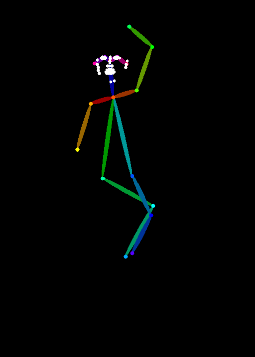 | 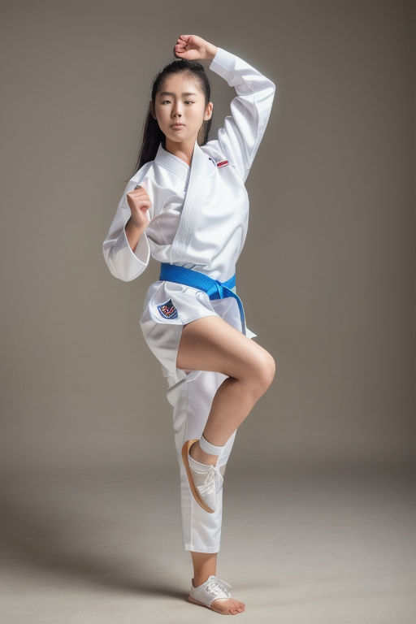 |

1화 결과와 비교:

| 1화 결과 (txt2img, 포즈 제어 없음) | 2화 결과 (OpenPose ControlNet) |
|:---:|:---:|
| 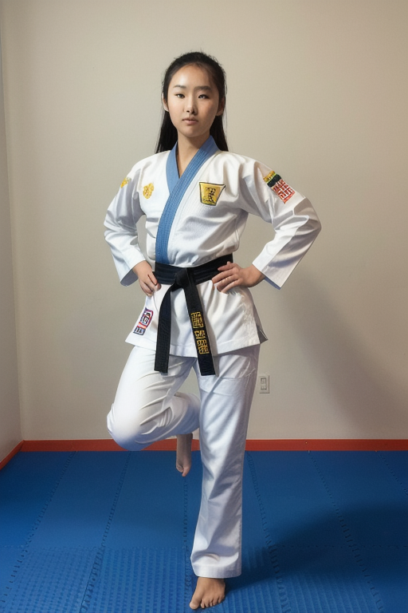 |  |

1화에서 프롬프트만으로는 학다리 자세가 나오지 않았지만, 참조 사진의 포즈를 OpenPose로 지정하니 한 발로 서서 무릎을 올린 형태가 나온다. 태권도복도 대략적으로 반영됐다.

같은 참조 사진에 Canny와 Depth를 적용하면 어떻게 달라지는지 비교했다.

| OpenPose | Canny | Depth |
|:---:|:---:|:---:|
|  | 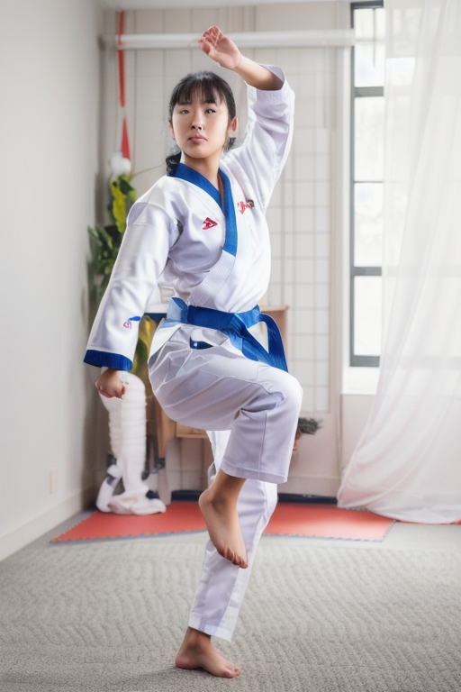 | 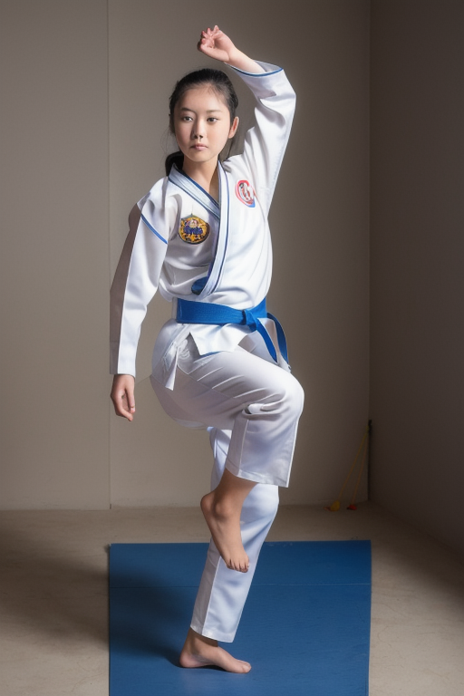 |

OpenPose는 관절 위치만 참조하므로 배경, 의상, 인물 외형은 프롬프트대로 자유롭게 생성된다. Canny는 인물의 윤곽선을 충실하게 따라가서, 참조 사진의 옷 주름이나 실루엣이 결과에 남는다. Depth는 인물의 공간감과 비율을 유지하면서도 세부 디테일은 비교적 자유롭다.

세 결과를 비교하면 차이가 분명하다. OpenPose는 배경과 의상이 프롬프트대로 자유롭게 생성됐지만, 포즈의 정밀도는 가장 낮다. Canny는 자세가 가장 정확하지만 참조 사진의 형태에 종속적이다. Depth는 그 중간이다.

그렇다면 OpenPose의 자유도와 Canny의 정밀도를 합칠 수 있을까? 본문에서 다뤘듯이, ComfyUI에서는 Apply ControlNet 노드를 직렬로 연결해서 여러 ControlNet을 동시에 적용할 수 있다. OpenPose(strength 1.0)로 포즈 뼈대를 잡고, Canny(strength 0.5)로 윤곽선 정밀도를 보강한 결과:

| OpenPose 단독 | Canny 단독 | OpenPose + Canny 조합 |
|:---:|:---:|:---:|
|  |  | 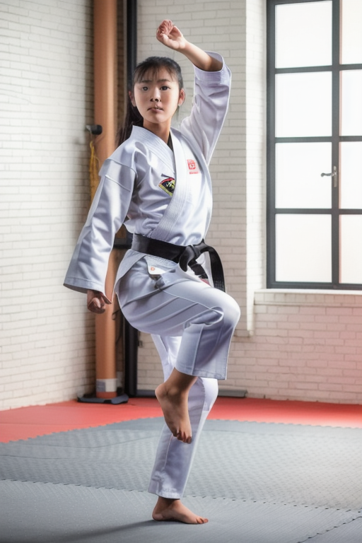 |

조합 결과는 OpenPose 단독보다 자세가 정확하고, Canny 단독보다 배경이 깔끔하다. 이 시리즈에서는 **OpenPose + Canny 조합 결과를 기준으로 진행한다.**

다만 정확한 학다리 서기와는 차이가 있다. OpenPose가 참조 사진에서 관절 위치를 추출할 때 들어올린 발의 위치나 무릎 각도가 왜곡될 수 있고, 그 오차가 생성 결과에 그대로 반영된다. 포즈맵을 수동으로 보정하거나, 다른 ControlNet과 조합하는 방법은 이후 편에서 다룬다.


## 정리

2화에서 배운 것:

- **ControlNet**은 참조 이미지의 구조 정보로 생성을 제어한다
- **OpenPose** — 관절 위치를 잡는다. 포즈 제어의 기본
- **Canny** — 윤곽선 전체를 따른다. 형태 유지에 적합
- **Depth** — 깊이 정보를 유지한다. 구도와 원근감 제어
- **Strength는 1.0** 전후로. 1.5 이상은 아티팩트 위험
- **End Percent**는 기본값 1.0으로 충분하다. 차이가 거의 없다
- 참조 이미지는 **배경 단순, 인물 한 명, 관절 노출**이 기본
- ControlNet과 체크포인트의 **SD 버전을 일치**시켜야 한다

txt2img에서는 운에 맡기던 포즈를, ControlNet으로 의도한 대로 잡을 수 있게 됐다. 다음에는 얼굴이 마음에 들지 않는 문제를 다뤄볼 생각이다.

---

*이전: [1화. 첫 생성 — 프롬프트만 넣으면 되는 거 아니야?](ai-image-guide-01-first-gen.md)*
*다음: [3화. 얼굴 — 인페인팅과 FaceDetailer](ai-image-guide-03-face.md)*
