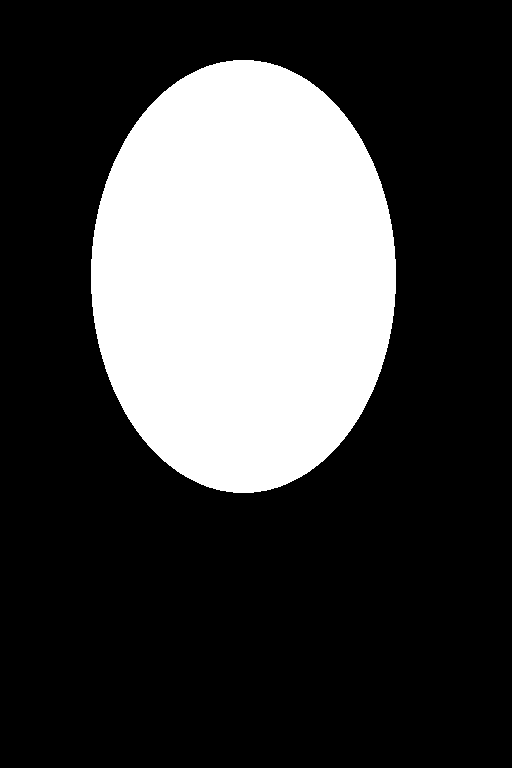
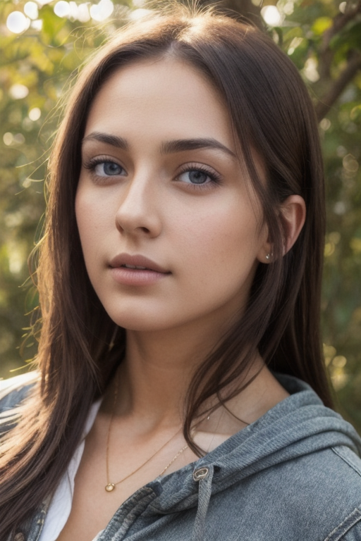
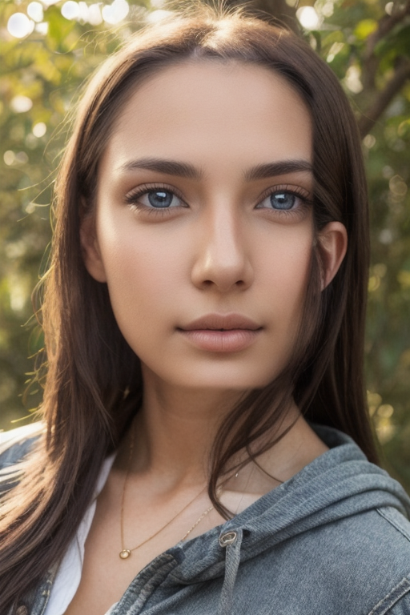
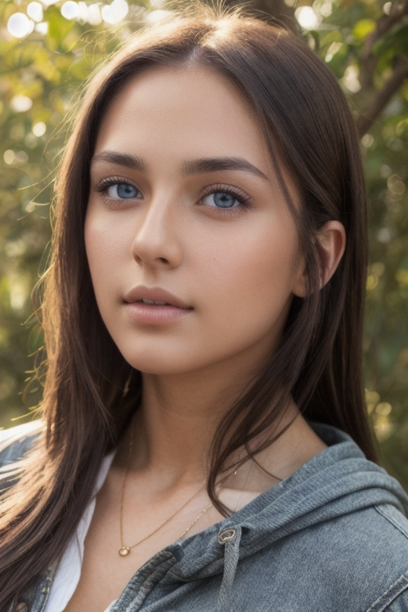

# 3화. 얼굴 — 인페인팅과 FaceDetailer

*AI 이미지 생성 실전 가이드 | 사진 한 장을 완성하기까지*

<!-- more -->

---

## 들어가며

2화에서 포즈는 대충 잡았지만, 얼굴이 문제다.

512x768 해상도에서 전신을 뽑으면 얼굴에 할당되는 픽셀이 얼마 안 된다. 전체 이미지가 512x768일 때, 얼굴 영역은 대략 80x100 픽셀 정도다. 이 해상도로는 눈, 코, 입의 디테일을 제대로 표현할 수 없다. 결과적으로 얼굴이 뭉개지거나, 좌우가 비대칭이거나, 눈 크기가 다르거나 — SD 1.5의 전형적인 문제가 나타난다.

이번 화에서 다루는 해결 방법은 두 가지다. 하나는 문제 영역을 직접 지정해서 다시 생성하는 **인페인팅**, 다른 하나는 얼굴을 자동으로 감지해서 보정하는 **FaceDetailer**다.


## 인페인팅이란

인페인팅(inpainting)은 이미지의 특정 영역만 마스킹해서 다시 생성하는 기법이다. 전체를 새로 뽑지 않고, 문제가 있는 부분만 교체한다.

원리는 단순하다.

1. 원본 이미지에서 수정할 영역을 마스크로 지정한다 (흰색 = 다시 생성, 검은색 = 유지)
2. 마스킹된 영역만 노이즈를 넣고 디노이징한다
3. 주변 픽셀과 자연스럽게 합성된다

ComfyUI에서의 기본 인페인팅 워크플로 구조:

```
[이미지 로드] → [VAE 인코드] → [마스크 적용] → [KSampler] → [VAE 디코드] → [저장]
[마스크 로드] ────────────────────┘
```

txt2img와 비슷하지만, 빈 잠재 이미지 대신 **원본 이미지의 잠재 표현에 마스크를 씌운 것**이 KSampler에 들어간다는 점이 다르다.


## 수동 인페인팅으로 얼굴 수정

### 마스크 만들기

마스크는 "어디를 다시 그릴 것인가"를 지정하는 흑백 이미지다. 흰색 영역이 다시 생성되고, 검은색 영역은 원본이 유지된다.

**ComfyUI에서 마스크 만드는 방법:**

1. **LoadImage 노드**에 원본 이미지를 불러온다
2. 노드 위에서 **우클릭 → Open in MaskEditor**를 선택한다
3. MaskEditor가 열리면 브러시로 수정할 영역(얼굴)을 칠한다
4. 칠한 영역이 마스크의 흰색 부분이 된다
5. **Save to node** 버튼을 누르면 마스크가 LoadImage 노드에 저장된다

외부 이미지 편집기(GIMP, Photoshop 등)에서 만들어도 된다. 원본과 같은 크기의 검은색 이미지를 만들고, 수정할 영역을 흰색으로 칠하면 된다.

실제 마스크 예시:

| 원본 | 마스크 |
|:---:|:---:|
|  |  |

마스크의 크기가 중요하다. 얼굴 윤곽에 딱 맞게 그리면 경계 부분에 이음새가 생긴다. 마스크 안쪽은 새로 생성된 영역이고 바로 바깥은 원본이라, 피부색이나 조명이 미묘하게 달라서 경계가 눈에 띈다. **얼굴 윤곽보다 10~20% 정도 여유를 두는 것이 적당하다.** 너무 크면 머리카락이나 옷까지 불필요하게 변경된다.

### Denoise Strength — 가장 중요한 파라미터

인페인팅에서 denoise strength는 "얼마나 많이 바꿀 것인가"를 결정한다.

| Denoise | 효과 |
|---------|------|
| 0.0 | 변화 없음. 원본 그대로 |
| 0.3 | 미세한 보정. 피부결, 색감 정도만 달라진다 |
| 0.5 | 중간. 얼굴 형태는 유지하면서 디테일이 개선된다 |
| 0.7 | 상당한 변화. 얼굴이 많이 달라질 수 있다 |
| 1.0 | 완전히 새로 생성. 마스크 영역을 백지로 보고 다시 그린다 |

같은 이미지에 denoise만 바꿔서 인페인팅한 결과:

| 원본 | Denoise 0.3 | Denoise 0.5 | Denoise 1.0 |
|:---:|:---:|:---:|:---:|
|  |  |  |  |

> **설정**: Realistic Vision V5.1 | 512x768 | DPM++ SDE Karras | Steps 20 | CFG 7.0 | Seed 20 → 인페인팅 Seed 42

0.3에서는 미세한 보정에 그치지만, 0.5부터 눈과 피부 질감이 눈에 띄게 달라진다. 1.0에서는 마스크 영역이 완전히 새로 생성되어 아예 다른 사람이 된다.

**얼굴 보정 목적이라면 0.4~0.6이 실용적인 범위다.** 0.3 이하는 변화가 너무 적고, 0.7 이상은 원래 얼굴과 동떨어진 결과가 나온다.

### 수동 인페인팅의 한계

수동 인페인팅은 정밀하다. 원하는 영역만 정확하게 지정할 수 있고, 프롬프트와 denoise를 세밀하게 조절할 수 있다. 그런데 번거롭다.

- 이미지마다 마스크를 직접 그려야 한다
- 얼굴 위치가 바뀌면 마스크도 새로 만들어야 한다
- 여러 장을 배치로 처리할 수 없다
- 마스크 영역 설정에 시행착오가 필요하다

한두 장 보정할 때는 수동 인페인팅이 낫다. 하지만 여러 장을 만들면서 매번 얼굴을 고치는 상황이라면, 자동화가 필요하다.


## FaceDetailer: 자동 얼굴 보정

### 개요

FaceDetailer는 ComfyUI Impact Pack에 포함된 노드다. 원리는 수동 인페인팅과 같지만, **얼굴 감지부터 마스킹, 인페인팅까지 전부 자동**이다.

동작 과정:

1. 감지 모델(YOLOv8 등)이 이미지에서 얼굴 위치를 찾는다
2. 감지된 영역을 잘라낸다 (crop)
3. 잘라낸 영역을 높은 해상도로 인페인팅한다
4. 보정된 얼굴을 원본에 다시 합성한다

수동 인페인팅과의 핵심 차이는 **3번**이다. 전체 이미지에서 인페인팅하는 게 아니라, 얼굴 영역만 잘라내서 확대한 뒤 인페인팅한다. 512x768 이미지에서 80x100 픽셀짜리 얼굴을 384x384로 확대해서 처리하는 것이다. 디테일이 좋아질 수밖에 없다.

### 설치

ComfyUI Impact Pack과 Impact Subpack을 설치한다.

```bash
cd ComfyUI/custom_nodes/
git clone https://github.com/ltdrdata/ComfyUI-Impact-Pack.git
git clone https://github.com/ltdrdata/ComfyUI-Impact-Subpack.git

# 각각 의존성 설치
cd ComfyUI-Impact-Pack && pip install -r requirements.txt
cd ../ComfyUI-Impact-Subpack && pip install -r requirements.txt
```

얼굴 감지 모델도 필요하다. [Bingsu/adetailer](https://huggingface.co/Bingsu/adetailer) 저장소에서 `face_yolov8m.pt`를 다운로드한다.

```
ComfyUI/
  models/
    ultralytics/
      bbox/
        face_yolov8m.pt
```

ComfyUI를 재시작하면 FaceDetailer 노드가 추가된다.

### 워크플로 구성

```
[이미지 로드] ──────────────────────────┐
[체크포인트 로드] → [프롬프트] ────────────→ [FaceDetailer] → [저장]
[UltralyticsDetectorProvider] ──────────┘
```

기본 txt2img 워크플로보다 단순하다. 이미지를 넣고 FaceDetailer에 연결하면 끝이다. 복잡한 것은 FaceDetailer 노드 내부에서 전부 처리한다.

### 주요 파라미터

FaceDetailer의 파라미터는 많지만, 실제로 건드릴 것은 몇 개 되지 않는다.

**감지 관련:**

| 파라미터 | 기본값 | 설명 |
|---------|--------|------|
| bbox_threshold | 0.5 | 얼굴 감지 신뢰도 임계값. 낮으면 더 많이 잡고, 높으면 확실한 것만 잡는다 |
| bbox_dilation | 10 | 감지된 영역을 얼마나 넓히는가. 얼굴 주변 여백 |
| bbox_crop_factor | 3.0 | 얼굴 영역의 배율. 높으면 머리카락, 목까지 포함한다 |

**인페인팅 관련:**

| 파라미터 | 기본값 | 설명 |
|---------|--------|------|
| guide_size | 384 | 크롭된 얼굴의 인페인팅 해상도 |
| denoise | 0.5 | 수동 인페인팅과 같은 역할 |
| steps / cfg / sampler | 20 / 7.0 / dpmpp_sde | 인페인팅 샘플링 설정 |
| feather | 5 | 마스크 경계의 블렌딩 정도 |

**guide_size**가 FaceDetailer의 핵심이다. 원본에서 80x100 픽셀이던 얼굴을 384x384로 확대해서 인페인팅하고, 다시 원래 크기로 줄여서 합성한다. 이 과정에서 디테일이 추가된다.

### Denoise 비교

수동 인페인팅과 마찬가지로, FaceDetailer에서도 denoise가 결과를 좌우한다.

| 원본 | Denoise 0.3 | Denoise 0.5 | Denoise 0.7 |
|:---:|:---:|:---:|:---:|
|  |  |  |  |

> **설정**: Realistic Vision V5.1 | guide_size 384 | DPM++ SDE Karras | Steps 20 | CFG 7.0 | Seed 42 | face_yolov8m | 원본 Seed 20

수동 인페인팅과 비교하면, FaceDetailer는 같은 denoise에서 좀 더 안정적인 결과가 나온다. 얼굴 영역만 정확하게 크롭해서 처리하기 때문에, 주변 영역이 불필요하게 변경되는 문제가 적다.

0.5에서 얼굴이 개선되면서도 전체 이미지와 일관성이 유지된다. 0.7부터는 얼굴이 나머지 부분보다 "깔끔해 보이는" 현상이 나타날 수 있다.


## 수동 인페인팅 vs FaceDetailer

| | 수동 인페인팅 | FaceDetailer |
|---|---|---|
| 마스크 | 직접 그린다 | 자동 감지 |
| 해상도 | 원본 해상도에서 처리 | 크롭 후 확대해서 처리 |
| 정밀도 | 높음 (원하는 대로 조절) | 중간 (자동이라 제한적) |
| 편의성 | 낮음 | 높음 |
| 배치 처리 | 어려움 | 가능 |
| 적합한 상황 | 한두 장, 세밀한 조정 | 여러 장, 일괄 보정 |

실전에서는 **FaceDetailer를 기본으로 쓰고, 결과가 마음에 들지 않을 때 수동 인페인팅으로 미세 조정**하는 흐름이 된다. FaceDetailer를 txt2img → ControlNet 워크플로 뒤에 붙이면, 생성할 때마다 자동으로 얼굴이 보정된다.


## 삽질 기록

### 마스크 크기와 이음새

수동 인페인팅에서 마스크를 얼굴에 딱 맞게 그렸더니, 경계 부분에 부자연스러운 이음새가 생겼다. 마스크 안쪽은 새로 생성한 얼굴이고, 바로 바깥은 원본 이미지다. 피부색이나 조명이 미묘하게 달라서 경계가 보인다.

해결: 마스크를 넉넉하게 그리고, feather(페더링) 값을 높인다. 페더링은 마스크 경계를 흐리게 처리해서 안쪽과 바깥쪽이 자연스럽게 섞이게 한다. ComfyUI에서는 MaskBlur 노드를 사용하거나, KSampler의 설정에서 조절할 수 있다.

### FaceDetailer가 얼굴을 못 찾는 경우

전신 이미지에서 얼굴이 너무 작으면 감지 모델이 놓칠 수 있다. bbox_threshold를 0.3으로 낮추면 더 공격적으로 감지하지만, 대신 얼굴이 아닌 부분(무릎, 주먹 등)을 얼굴로 오인할 수 있다.

안정적인 방법은 guide_size를 256으로 낮추거나, bbox_crop_factor를 높여서 더 넓은 영역을 잡는 것이다.

### Denoise 1.0의 함정

수동 인페인팅에서 denoise를 1.0으로 올리면, 마스크 영역을 완전히 새로 그린다. 얼굴뿐 아니라 마스크에 걸린 의상, 머리카락까지 전부 달라진다. 소매 색이 바뀌거나, 헤어스타일이 달라지거나, 피부색이 달라져서 주변과 동떨어진 결과가 나온다.

얼굴 보정 목적이라면 denoise는 0.6 이하를 넘기지 않는 것이 안전하다.

### Impact Pack 설치 시 주의

Impact Pack의 requirements.txt에 torch가 포함되어 있다. 이미 설치된 PyTorch와 버전이 충돌할 수 있다. 특히 RTX 50시리즈처럼 nightly 빌드를 쓰는 환경에서는 pip이 torch를 덮어쓰면서 CUDA 호환성이 깨질 수 있다. 설치 후 `torch.cuda.is_available()`을 확인하는 것이 좋다.


## 시리즈 작업물: 얼굴 보정

2화에서 만든 학다리 자세 결과물에 FaceDetailer를 적용했다.

> **FaceDetailer 설정**: guide_size 384 | denoise 0.5 | DPM++ SDE Karras | Steps 20 | CFG 7.0 | face_yolov8m

| 2화 결과 (OpenPose + Canny 조합, 보정 전) | 3화 결과 (FaceDetailer 적용) |
|:---:|:---:|
|  |  |

1화부터의 진행 비교:

| 1화 (txt2img) | 2화 (OpenPose + Canny 조합) | 3화 (FaceDetailer) |
|:---:|:---:|:---:|
|  |  |  |

1화에서 포즈를 잡을 수 없었고, 2화에서 OpenPose + Canny 조합으로 포즈를 잡았고, 3화에서 얼굴 디테일을 개선했다. 전신 이미지에서 얼굴이 차지하는 비율이 작아서 극적인 차이는 아니지만, 확대하면 눈과 피부의 선명도가 달라진 것을 확인할 수 있다.

아직 남은 문제가 있다. 손과 발의 디테일, 의상의 정확성, 그리고 전체 해상도. 다음에는 해상도를 올리는 방법을 다뤄볼 생각이다.


## 정리

3화에서 배운 것:

- **인페인팅**은 이미지의 특정 영역만 다시 생성하는 기법이다
- **Denoise 0.4~0.6**이 얼굴 보정에 적합한 범위다. 1.0은 완전히 다른 얼굴이 된다
- **FaceDetailer**는 얼굴 감지 → 크롭 → 확대 인페인팅 → 합성을 자동화한다
- FaceDetailer의 핵심은 **guide_size** — 작은 얼굴을 확대해서 처리하기 때문에 디테일이 좋아진다
- 수동 인페인팅은 정밀하지만 번거롭고, FaceDetailer는 편하지만 세밀한 조정이 제한적이다
- 실전에서는 **FaceDetailer를 기본으로 쓰고, 필요하면 수동으로 미세 조정**한다
- 마스크 경계의 이음새는 **페더링**으로 완화한다

---

*이전: [2화. 구도와 포즈 — ControlNet 입문](ai-image-guide-02-controlnet.md)*
